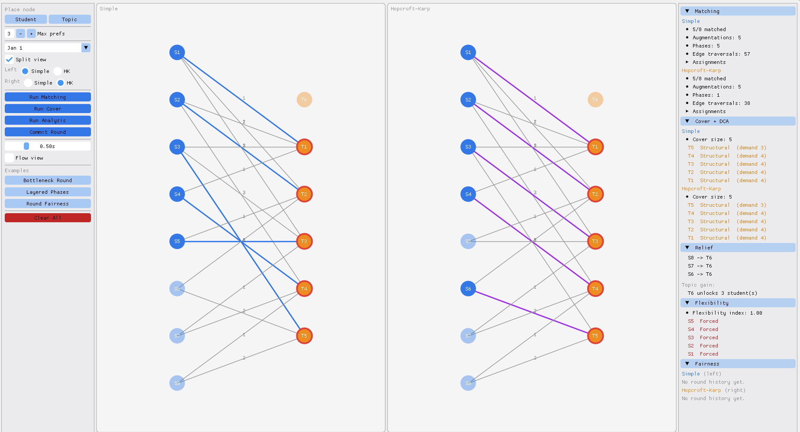

# Seminar Assignment Engine

Interactive tool for solving the seminar topic assignment problem using bipartite matching, with step-by-step algorithm animations and a split-canvas comparator. Models students and topics as a bipartite graph and finds a **maximum matching**, then layers four analyses on top: **minimum vertex cover, demand pressure classification, assignment necessity, and relief advising**.

A professor enters students, topics, and ranked preferences. The engine finds the assignment that matches as many students as possible, then answers three practical questions: *which topics are structural bottlenecks, which student assignments are forced versus swappable*, and *which topics each unmatched student should add to their preferences to get assigned.*



**Tech focus:**  
C++17 · Dear ImGui · GLFW · OpenGL3 · CMake

**Algorithm focus:**  
Simple Matching (BFS) · Hopcroft-Karp · König's Minimum Vertex Cover · Demand Cover Analysis · Assignment Necessity · Relief Advisor

## Features

- **Side-by-side comparator** — split canvas runs two algorithm configurations simultaneously on the same graph with independent results, cover, and fairness history per canvas
- **Step-by-step animation** — each augmenting path animated with directional arrowheads, non-path edges dimmed, and a step/phase counter overlay; speed adjustable
- **Flow network view** — toggle to overlay source and sink nodes with capacity labels on all edges
- **Interactive graph editor** — place students and topics, draw ranked preference edges, drag to rearrange; right-click to delete
- **Multi-round history** — commit results across six exam periods; previously assigned topics are automatically excluded in subsequent rounds
- **Fairness table** — tracks matched/unmatched status per student across committed rounds with a missed-round counter; independent per canvas in split mode
- **Three built-in examples** — Bottleneck Round, Layered Phases, Round Fairness — each designed to stress a different aspect of the algorithm

---

## Matching

### Simple Matching — O(V · E)

For each unmatched student, runs a BFS over the preference graph to find an augmenting path. When found, flips it to extend the matching by one. Repeats until no augmenting path exists.

> **Augmenting path.** A path through the graph that lets you increase the matching size by one. It has three properties:
>
> 1. Starts at an unmatched student
> 2. Ends at a free (unmatched) topic
> 3. Alternates — unmatched preference edge, matched edge, unmatched edge, matched edge...
>
> When you find one, you flip every edge on it — matched becomes unmatched, unmatched becomes matched. The path had one more unmatched edge than matched, so after flipping you gain one more matched pair.
>
> Example: `S1 → T1 → S2 → T2` where T1 is held by S2 and T2 is free.  
> S1 wants T1. T1's current owner S2 also wants T2, which is free. Flip: S1 gets T1, S2 moves to T2. Net gain: +1.
>
> By **Berge's theorem**, a matching is maximum if and only if no augmenting path exists. Both algorithms keep finding and flipping augmenting paths until none remain.

### Hopcroft-Karp — O(√V · E)

Finds multiple shortest augmenting paths per phase instead of one at a time.

Each phase runs two steps:

1. **BFS** — launches simultaneously from all unmatched students and builds a layered graph of the shortest augmenting path length
2. **DFS** — extracts a maximal set of vertex-disjoint paths of that length and flips them all

>Because all paths in a phase have the same (minimum) length and are vertex-disjoint, the number of phases is bounded by **O(√V)**. Each phase costs **O(E)**, giving the **O(√V · E)** total complexity.

---

## Analysis

### Minimum Vertex Cover — O(V + E)

A vertex cover is a set of nodes such that every preference edge touches at least one node in it — the smallest set of students and topics that collectively account for every expressed preference. The professor can use it to identify exactly which nodes are structural bottlenecks.

> **König's theorem.** In any bipartite graph, the size of the minimum vertex cover equals the size of the maximum matching. Once you have a maximum matching, you already know the exact size of the smallest possible cover — and the construction below extracts it directly from that matching without any additional search.

**Construction — reachability walk:**

1. Start from every unmatched student — they are free, so they can try any preference edge
2. Follow any preference edge to a topic. If that topic is already taken, its current owner might be able to swap to something else — follow the matching edge back to that student
3. Keep chasing swaps: preference edge forward, matching edge back, preference edge forward...
4. Everything reachable this way is flexible — it could potentially be rerouted

The cover consists of the matched students the walk **could not** reach, plus the topics it **did** reach:

- **Students in cover** — locked in with their topic; no swap chain goes through them
- **Topics in cover** — contested; at least one unmatched student can reach them through a chain of swaps

The cover is the smallest set of nodes that explains why the remaining students could not be matched.

### Demand Cover Analysis

Classifies each topic by combining its **demand** (how many students listed it) with whether it ended up **in the König cover**. Threshold is the median demand across all topics. The professor can use this to distinguish topics that need more capacity from topics that are in the cover for purely structural reasons.

| Label | Demand | In cover | Meaning |
|---|---|---|---|
| **Confirmed** | High | Yes | Contested and reachable — genuine capacity bottleneck |
| **Resolved** | High | No | Contested but fully absorbed by the matching |
| **Structural** | Low | Yes | Reached via swap chain despite low demand |
| **Clear** | Low | No | Unreachable from any unmatched student; irrelevant |

> **Absorption rate** = `resolved / (confirmed + resolved)` — the fraction of high-demand topics the matching successfully handled. 1.0 means every contested topic was resolved; 0.0 means every contested topic remains a bottleneck. Undefined when no high-demand topics exist.

### Matching Flexibility

After finding a maximum matching, asks for each matched pair: *is there any other maximum matching where this student gets a different topic?* The professor can use this to quickly see which students can be accommodated if they object to their assignment, and which ones cannot be moved without reducing the total number of matched students.

- **Forced** — every maximum matching of this graph assigns this student to this topic. There is no alternative; moving them would cost a matched pair somewhere else.
- **Flexible** — the matching could look different and still be maximum. This student could be reassigned without any loss. In other words, the optimal solution is not unique.

> **How it is checked for one pair (S → T):**
>
> 1. Temporarily unmatch S from T
> 2. Try to find an augmenting path from S, excluding T
> 3. Path found → S can be matched elsewhere → assignment is **flexible**
> 4. No path → S cannot be matched without T → assignment is **forced**
>
> **Necessity index** = `forced / total matched`
>
> - **1.0** — every assignment is forced; the professor has no room to swap anyone
> - **0.0** — every assignment is flexible; any student who objects can be accommodated

### Relief Advisor

For each **unmatched** student, finds which topics — if added to their preference list — would get them assigned, possibly through a chain of swaps. The professor can use this to have a direct conversation with unmatched students: *"If you are willing to consider T3 or T5, I can fit you in."*

> **How it works for one student:**
>
> 1. Temporarily add a fake preference edge from the student to a candidate topic
> 2. Try to find an augmenting path from the student
> 3. Path exists → adding this topic would unlock an assignment → it is a **relief topic**
> 4. Remove the fake edge and move on to the next candidate
>
> This is repeated for every topic not already in the student's preferences.

Topics are also ranked by **gain** — how many unmatched students have a relief path that runs through that topic. A gain of 3 means three different students could each be assigned if that topic had an extra slot, though not simultaneously — only one student can hold a topic at a time. This gives the professor a prioritized list of where adding capacity would have the most impact.

---

## Build

**Requirements:** C++ compiler with C++17 support, CMake 3.16 or newer, OpenGL (system-provided). GLFW and Dear ImGui are fetched automatically via CMake FetchContent.

```bash
git clone git@github.com:andja45/seminar-assignment-with-bipartite-matching.git
cd seminar-assignment-with-bipartite-matching
```

GUI application:
```bash
cmake -B build -DBUILD_GUI=ON
cmake --build build --target gui_app
./build/gui/gui_app
```

Core library and CLI demo only:
```bash
cmake -B build
cmake --build build --target core_demo
./build/core/core_demo
```

---

## Usage

### Canvas

| Action | Result |
|---|---|
| Select node type (left panel), then left-click empty space | Place a student or topic |
| Left-click a student, then left-click a topic | Draw a ranked preference edge |
| Left-click and drag a node | Move it |
| Right-click a node | Delete node and all its edges |
| Right-click an edge | Delete that edge |
| Double-click a student | Toggle inactive (excluded from matching) |
| Hover any node | Show match result, flexibility, relief, and round history |

### Controls (left panel)

- **Student / Topic** — select node type for placement; click again to deselect
- **Max prefs** — maximum preference edges per student
- **Period** — active exam round (Jan 1 through Sep 2)
- **Split view** — split canvas for side-by-side algorithm comparison
- **Simple / HK** — per-canvas algorithm selection
- **Run Matching** — compute and animate the maximum matching
- **Run Cover** — compute minimum vertex cover and DCA
- **Run Analysis** — compute assignment necessity and relief advisor
- **Commit Round** — record this round's result to history; previously assigned topics are excluded in the next round
- **Speed** — animation step delay
- **Flow view** — overlay source/sink nodes and capacity labels
- **Bottleneck Round / Layered Phases / Round Fairness** — load a built-in example
- **Clear All** — reset everything

### Color reference

| Color | Meaning |
|---|---|
| Blue node | Student |
| Orange node | Topic |
| Dimmed node | Unmatched after matching |
| Gray (strikethrough) node | Inactive student |
| Blue edge | Matched edge (Simple) |
| Purple edge | Matched edge (Hopcroft-Karp) |
| Gray dashed edge | Blocked (topic assigned in a previous round) |
| Cyan edge with arrow | Augmenting path during animation |
| Red ring on node | Node is in the minimum vertex cover |
